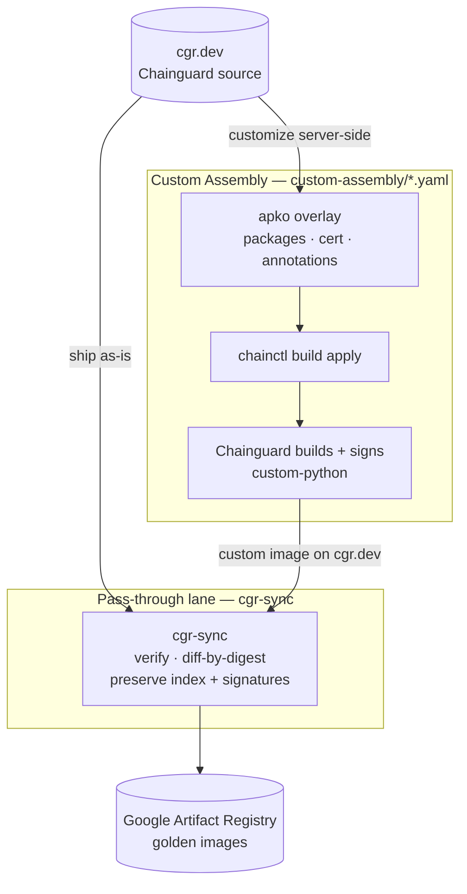

# Chainguard Golden Images Pipeline Example

## Goals

- Demonstrate an ingestion pipeline for Chainguard images into a Golden Images repository
- Assume a Platform Engineer perspective
- Demonstrate best practices — server-side customization via Custom Assembly, signature verification before mirroring, and preserving upstream signatures/attestations

## Non-Goals

- Not all-encompassing; this is a "what could be" example of a potential pipeline

## Pipeline overview

Two complementary lanes feed the golden-images registry (Google Artifact Registry). Customization happens **server-side** with Chainguard Custom Assembly (no derived Dockerfiles), and everything reaches Artifact Registry through the `cgr-sync` pass-through mirror:



### 1. Custom Assembly — `custom-assembly/*.yaml`

For images that need modification (extra packages, certificates, annotations). Chainguard assembles and **signs** the customized image server-side from an apko overlay — there's no derived Dockerfile to maintain, and the customization is captured in the image's provenance. See the [Custom Assembly](#custom-assembly-custom-assembly) section below.

### 2. Pass-through lane — `cgr-sync.yaml` + `.github/workflows/passthrough-mirror.yaml`

Mirrors images **as-is** from `cgr.dev` into the registry with [`cgr-sync`](https://github.com/cartyc/image-syncer) — including the Custom Assembly images built above:

- Preserves the **multi-arch index** and the **upstream cosign signatures / attestations**.
- **Verifies** each image's signature before copying (Chainguard's signing identity; Custom Assembly images use the org's build identity — see `cgr-sync.yaml`).
- **Diffs by digest** — only copies what's missing or changed, so re-runs are cheap.
- Adding an image is a one-line entry in `cgr-sync.yaml`.
- After mirroring, a **`verify` job independently checks each golden image in Artifact Registry**: a `grype` CVE scan (fails on `critical` by default — set the `GRYPE_FAIL_ON` variable to adjust) plus a `cosign verify-attestation` SBOM check, reusing the per-image identities from `cgr-sync.yaml`.

Runs on a schedule (every 6h) plus manual dispatch (timer-driven — it does not run on merge; use the manual trigger to mirror a catalog change immediately).

### Which lane?

| The image… | Lane |
| --- | --- |
| needs extra packages, certs, or other modification | **Custom Assembly** (built + signed by Chainguard) |
| ships unmodified | **pass-through** |

Either way the image lands in Artifact Registry via the pass-through mirror.

## Repository layout

| Path | What it is | How you use it |
| --- | --- | --- |
| `cgr-sync.yaml` | The **pass-through catalog** — which images/tags get mirrored as-is from `cgr.dev` into Artifact Registry, plus the signature-verify policy. | Add or remove an image by editing the `repositories:` list (one entry = a repo + its tags); shared `defaults:` cover source, destination, and verify. `${VAR}` placeholders are filled from the workflow's secrets at run time. |
| `custom-assembly/` | Chainguard **Custom Assembly** overlays — declarative, server-side image customizations (apko). | See the table rows below; the build workflow merges the base with each per-image overlay and applies the result. |
| &nbsp;&nbsp;`custom-assembly/all.yaml` | The **base** overlay, merged into **every** custom image. | Put things that should apply everywhere here — common packages, env vars, annotations, and the internal CA. Edit this to change all custom images at once. |
| &nbsp;&nbsp;`custom-assembly/<image>.yaml` | A **per-image** overlay (e.g. `python.yaml`, `jdk.yaml`). | Image-specific packages/config, layered on top of `all.yaml`. The filename maps to a target repo in the build workflow's matrix; to customize one image, edit its file. |
| `python/cert.crt` | The internal CA certificate (PEM) bundled into custom images. | A self-signed **placeholder** ("Example Internal Root CA") — replace it with your org's real root CA, and keep it in sync with the inlined copy in `all.yaml`. |
| `scripts/` | Helper scripts the CI calls (they both read `cgr-sync.yaml`). | `list-golden-images.py` → emits the verify targets for the post-mirror check; `list-source-refs.py` → emits source refs for the pre-merge existence check. Not run by hand normally. |
| `.github/workflows/` | The CI lanes (see the next table). | — |
| `LICENSE` | Apache-2.0. | — |

### Workflows (`.github/workflows/`)

| Workflow | Triggers | What it does |
| --- | --- | --- |
| `passthrough-mirror.yaml` | schedule (6h) + manual | Mirrors the `cgr-sync.yaml` catalog into Artifact Registry with `cgr-sync` (verify-before-mirror, signatures/attestations preserved), then independently verifies each landed image (grype CVE gate + cosign SBOM attestation). |
| `custom-assembly.yaml` | PR/push on `custom-assembly/**` + manual | Merges `all.yaml` with each per-image overlay and applies it via `chainctl` so Chainguard builds + signs the custom image — `--dry-run` preview on PRs, real apply on merge to `main`. |
| `validate.yml` | every PR + push to `main` | Lints the workflows and configs (`actionlint`, `yamllint`) and confirms `cgr-sync.yaml` / overlays parse. |
| `validate-catalog.yml` | PR touching `cgr-sync.yaml` | Pre-merge check that every source `image:tag` in the catalog actually exists at `cgr.dev`. |
| `digestabot.yaml` | schedule (daily) + manual | Opens a PR bumping pinned image/action digests in the repo to their latest. |

## Required secrets

| Secret | Used by |
| --- | --- |
| `DEST_REGISTRY`, `REGION`, `SERVICE_ACCOUNT_KEY` | pass-through lane (Artifact Registry destination + auth) |
| `CHAINGUARD_IDENTITY` | all workflows — the assumable Chainguard identity for `setup-chainctl` (`<org-uidp>/<identity-id>`) |
| `CHAINGUARD_ORG` | source namespace — your org's registry name (e.g. `your-org.com`), used as `cgr.dev/${CHAINGUARD_ORG}` and the Custom Assembly `--parent` |
| `CHAINGUARD_ORG_UIDP` | pass-through verify policy — the org UIDP in the cosign identity regexp (the part before `/` in `CHAINGUARD_IDENTITY`) |

These were previously hard-coded; they're org identifiers (not credentials), but
parameterizing keeps the repo portable and free of org-specific values. The
pass-through lane also pulls a pinned `cgr-sync` release image from GHCR
(`ghcr.io/cartyc/image-syncer`) — public, so no token is needed.

## To Do

- Add FIPS image validation
- Add application image validation
- Expand the Custom Assembly and pass-through catalogs beyond Python

_The docker-build "transform" lane (build → grype → sign → chps → incert) was retired in favor of Custom Assembly, which builds and signs customized images server-side._

## Custom Assembly (`custom-assembly/`)

Some customizations are better done **server-side** with [Chainguard Custom Assembly](https://edu.chainguard.dev/chainguard/chainguard-images/features/ca-docs/custom-assembly/): Chainguard assembles and signs the customized image for you, so there's no derived Dockerfile to maintain and the change is recorded in the image's provenance.

`custom-assembly/python.yaml` (and `custom-assembly/jdk.yaml`) hold each image's **specific** packages (`bash`, `curl`), while `custom-assembly/all.yaml` holds the customizations common to **every** custom image (the internal CA, French Canadian locale `glibc-locale-fr` + `LANG`). Since `chainctl … apply --file` replaces a repo's whole config, `.github/workflows/custom-assembly.yaml` **merges `all.yaml` with each per-image overlay** (`yq '… *+ …'` — append arrays, per-image scalars win) and applies the merged result (a matrix over the images): `--dry-run` on PRs (drift preview), `apply --yes` on merge. To customize all images at once, edit `all.yaml`; for one image, edit its file.

### Prerequisites

Before the `custom-assembly` workflow can run, complete these one-time setup steps — skipping them produces the two failures we hit on first run (`missing: repo.update` and `no repo instance found`):

1. **Grant the CI identity `repo.update`.** The assumable identity in `CHAINGUARD_IDENTITY` needs the `repo.update` capability, or `apply` fails with `[PermissionDenied] ... missing: repo.update`. Bind a role that includes it to the identity, e.g.:

   ```sh
   chainctl iam role-bindings create \
     --identity=$CHAINGUARD_IDENTITY --role=<role-with-repo.update> --group=<your-org>
   ```

2. **Enable the custom-certificates Beta.** The overlays bundle an internal CA under `certificates:`; this Beta must be enabled for your org first — contact your Chainguard Customer Success team.

3. **Bootstrap each custom image once.** The declarative `apply` can't *create* an image (`--save-as` only works with `edit`), so create them from the committed overlays. Pass `--file` so `edit` uses the overlay instead of opening an interactive editor (there's no `--yes`, so confirm the diff when prompted):

   ```sh
   chainctl image repo build edit --parent <your-org> --repo python \
     --file custom-assembly/python.yaml --save-as custom-python
   chainctl image repo build edit --parent <your-org> --repo jdk \
     --file custom-assembly/jdk.yaml    --save-as custom-jdk
   ```

   The certs are read from the overlay's inline `certificates.additional` block; alternatively supply them from a PEM file with `--with-certificates=python/cert.crt`.

After bootstrapping, the workflow keeps each custom image in sync with its overlay on every merge to `main`.

The result, `cgr.dev/<your-org>/custom-python`, is built and signed by Chainguard — so the **pass-through lane** mirrors it to Artifact Registry like any other image (it's already wired into `cgr-sync.yaml`, with a verify policy scoped to the Custom Assembly signing identity). It only mirrors once the bootstrap above has created the image. The overlay also bundles the internal CA from `python/cert.crt` into the system truststore (replacing incert).

## Runbook — common tasks

> PRs target `main`. The pass-through mirror is timer-driven, so after merging a catalog change either wait for the next 6h run or trigger it manually.

### Add a pass-through image (mirror as-is)

1. Add an entry to `cgr-sync.yaml` under `repositories:`:
   ```yaml
   - name: redis
     tags:
       list: ["latest", "7"]
   ```
2. Open a PR. **`validate-catalog`** confirms every `image:tag` exists at `cgr.dev` before merge; **`validate`** lints the config.
3. Merge, then mirror it now instead of waiting: `gh workflow run passthrough-mirror.yaml` (or **Actions → Passthrough mirror → Run workflow**).
4. The `verify` job gates it (grype CVE scan + cosign SBOM attestation). A signing-identity mismatch means the tag is signed by a different identity than the policy allows — see *Verify failures* below.

### Customize **all** custom images

Edit `custom-assembly/all.yaml` (the base merged into every custom image), open a PR. The `custom-assembly` job posts a per-image **diff** (informational); on merge it applies and Chainguard rebuilds each image.

### Customize **one** image

Edit that image's `custom-assembly/<image>.yaml` (e.g. `python.yaml`). It's layered on top of `all.yaml` at apply time.

### Add a brand-new custom image

1. **One-time bootstrap** (the declarative `apply` can't create an image):
   ```sh
   chainctl image repo build edit --parent <your-org> --repo <base-image> \
     --file custom-assembly/<new>.yaml --save-as custom-<new>
   ```
2. Add a matrix entry in `custom-assembly.yaml` (`file:` + `repo:`).
3. Add `custom-<new>` to `cgr-sync.yaml` so it gets mirrored to Artifact Registry.

### Rotate / replace the internal CA

Replace **both** `python/cert.crt` and the inlined PEM in `custom-assembly/all.yaml` (keep them identical), open a PR, merge. The next `custom-assembly` apply rebuilds every image with the new CA.

### Change the locale (or other base env/packages)

Edit `custom-assembly/all.yaml` — e.g. swap `glibc-locale-fr` / `LANG` for another locale package + value. Applies to all custom images on merge.

### Upgrade `cgr-sync`

Bump `CGR_SYNC_IMAGE: ghcr.io/cartyc/image-syncer:vX.Y.Z` in `passthrough-mirror.yaml`, open a PR, merge.

### Verify failures

- **`grype found findings >= critical`** — a real CVE in the mirrored image. Triage upstream; to change the gate set the `GRYPE_FAIL_ON` repo variable (e.g. `high`).
- **`no matching signatures … got subjects [chainguard-images/images-private…]`** — the tag is signed by Chainguard's **public-catalog** identity, not your org's. Either give that repo a verify policy that accepts both identities, or drop the tag.
- **`SBOM attestation verification failed`** — check the identity regexp resolves (the `CHAINGUARD_ORG_UIDP` secret) and that the attestation exists on the mirror (`cosign tree <ref>`).
