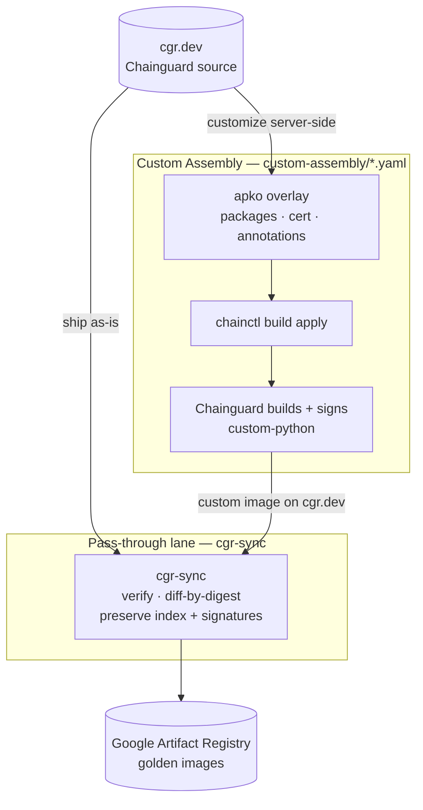

# Chainguard Golden Images Pipeline Example

## Goals

- Demonstrate an ingestion pipeline for Chainguard images into a Golden Images repository
- Assume a Platform Engineer perspective
- Demonstrate best practices — server-side customization via Custom Assembly, signature verification before mirroring, and preserving upstream signatures/attestations

## Non-Goals

- Not all-encompassing; this is a "what could be" example of a potential pipeline

## Pipeline overview

Two complementary lanes feed the golden-images registry (Google Artifact Registry). Customization happens **server-side** with Chainguard Custom Assembly (no derived Dockerfiles), and everything reaches Artifact Registry through the `cgr-sync` pass-through mirror:



### 1. Custom Assembly — `custom-assembly/*.yaml`

For images that need modification (extra packages, certificates, annotations). Chainguard assembles and **signs** the customized image server-side from an apko overlay — there's no derived Dockerfile to maintain, and the customization is captured in the image's provenance. See the [Custom Assembly](#custom-assembly-custom-assembly) section below.

### 2. Pass-through lane — `cgr-sync.yaml` + `.github/workflows/passthrough-mirror.yaml`

Mirrors images **as-is** from `cgr.dev` into the registry with [`cgr-sync`](https://github.com/cartyc/image-syncer) — including the Custom Assembly images built above:

- Preserves the **multi-arch index** and the **upstream cosign signatures / attestations**.
- **Verifies** each image's signature before copying (Chainguard's signing identity; Custom Assembly images use the org's build identity — see `cgr-sync.yaml`).
- **Diffs by digest** — only copies what's missing or changed, so re-runs are cheap.
- Adding an image is a one-line entry in `cgr-sync.yaml`.
- After mirroring, a **`verify` job independently checks each golden image in Artifact Registry**: a `grype` CVE scan (fails on `critical` by default — set the `GRYPE_FAIL_ON` variable to adjust) plus a `cosign verify-attestation` SBOM check, reusing the per-image identities from `cgr-sync.yaml`.

Runs on a schedule (every 6h), plus manual dispatch and on config change.

### Which lane?

| The image… | Lane |
| --- | --- |
| needs extra packages, certs, or other modification | **Custom Assembly** (built + signed by Chainguard) |
| ships unmodified | **pass-through** |

Either way the image lands in Artifact Registry via the pass-through mirror.

## Required secrets

| Secret | Used by |
| --- | --- |
| `DEST_REGISTRY`, `REGION`, `SERVICE_ACCOUNT_KEY` | pass-through lane (Artifact Registry destination + auth) |
| `CHAINGUARD_IDENTITY` | all workflows — the assumable Chainguard identity for `setup-chainctl` (`<org-uidp>/<identity-id>`) |
| `CHAINGUARD_ORG_UIDP` | pass-through verify policy — the org UIDP in the cosign identity regexp (the part before `/` in `CHAINGUARD_IDENTITY`) |

These were previously hard-coded; they're org identifiers (not credentials), but
parameterizing keeps the repo portable and free of org-specific values. The
pass-through lane also pulls a pinned `cgr-sync` release image from GHCR
(`ghcr.io/cartyc/image-syncer`) — public, so no token is needed.

## To Do

- Add FIPS image validation
- Add application image validation
- Expand the Custom Assembly and pass-through catalogs beyond Python

_The docker-build "transform" lane (build → grype → sign → chps → incert) was retired in favor of Custom Assembly, which builds and signs customized images server-side._

## Custom Assembly (`custom-assembly/`)

Some customizations are better done **server-side** with [Chainguard Custom Assembly](https://edu.chainguard.dev/chainguard/chainguard-images/features/ca-docs/custom-assembly/): Chainguard assembles and signs the customized image for you, so there's no derived Dockerfile to maintain and the change is recorded in the image's provenance.

`custom-assembly/python.yaml` (and `custom-assembly/jdk.yaml`) add `bash` and `curl` plus the internal CA to the python and jdk images — replacing the former docker-build pipelines (`python/Dockerfile.dev` and the distroless build). `.github/workflows/custom-assembly.yaml` applies every overlay in `custom-assembly/` (a matrix over the images): `--dry-run` on PRs (drift preview), `apply --yes` on merge.

**One-time bootstrap** — the declarative `apply` can't create an image (`--save-as` only works with `edit`), so create the custom image once:

```sh
chainctl image repo build edit --parent chriscarty.com --repo python --save-as custom-python
chainctl image repo build edit --parent chriscarty.com --repo jdk    --save-as custom-jdk
```

The result, `cgr.dev/chriscarty.com/custom-python`, is built and signed by Chainguard — so the **pass-through lane** mirrors it to Artifact Registry like any other image (it's already wired into `cgr-sync.yaml`, with a verify policy scoped to the Custom Assembly signing identity). It only mirrors once the bootstrap above has created the image. The overlay also bundles the internal CA from `python/cert.crt` into the system truststore (replacing incert); this uses the Custom Assembly custom-certificates **Beta**, which must be enabled for your org before the config will apply.
