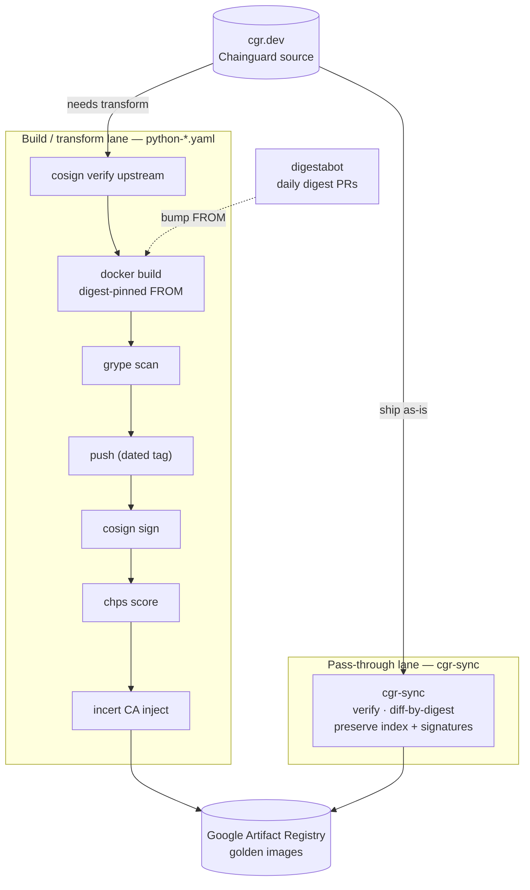

# Chainguard Golden Images Pipeline Example

## Goals

- Demonstrate an ingestion pipeline for Chainguard images into a Golden Images repository
- Assume a Platform Engineer perspective
- Demonstrate best practices — digestabot, pinning by digest instead of tags, signature verification, signing, and hardening scoring

## Non-Goals

- Not all-encompassing; this is a "what could be" example of a potential pipeline

## Pipeline overview

Two complementary lanes feed the golden-images registry (Google Artifact Registry):

### 1. Build / transform lane — `.github/workflows/python-*.yaml`

For images that need modification. Per image (Python `distroless` and `dev`):

1. `setup-chainctl` — auth to the Chainguard source registry.
2. **cosign verify** the upstream image's provenance.
3. **docker build** from a digest-pinned `FROM` (digestabot keeps the digest fresh). The `dev` variant repoints apk repositories to Artifactory mirrors (wolfi / extras); both stamp an `origin=chainguard` label.
4. **grype scan** (`anchore/scan-action`).
5. Push to Artifact Registry (date-stamped tag) → **cosign sign** → **chps-scorer** hardening score → **incert** to inject CA certs.

Triggered on changes under `python/**`; **digestabot** opens daily digest-bump PRs.

### 2. Pass-through lane — `cgr-sync.yaml` + `.github/workflows/passthrough-mirror.yaml`

For images shipped **as-is**. Uses [`cgr-sync`](https://github.com/cartyc/image-syncer) to mirror straight from `cgr.dev` into the registry:

- Preserves the **multi-arch index** and the **upstream cosign signatures / attestations** — which a `docker build … && docker push` flattens away.
- **Verifies** each image's signature before copying (the same identity the build lane checks).
- **Diffs by digest** — only copies what's missing or changed, so re-runs are cheap.
- Adding an image is a one-line entry in `cgr-sync.yaml` instead of a new workflow.

Runs on a schedule (every 6h), plus manual dispatch and on config change.

### Which lane?

| The image… | Lane |
| --- | --- |
| needs CA injection, apk mirroring, FIPS, or other modification | **build / transform** |
| ships unmodified | **pass-through** (faster, preserves upstream provenance) |

## Required secrets

| Secret | Used by |
| --- | --- |
| `DEST_REGISTRY`, `REGION`, `SERVICE_ACCOUNT_KEY` | both lanes (Artifact Registry destination + auth) |
| `ARTIFACTORY_HOSTNAME`, `ARTIFACTORY_USER_PROFILE`, `WOLFI_TOKEN`, `EXTRAS_TOKEN` | `dev` build (apk Artifactory mirrors) |
| `IMAGE_SYNCER_TOKEN` | pass-through lane (read access to `cartyc/image-syncer` to build `cgr-sync`) |

## To Do

- Optimize the build pipeline (trigger only on relevant path changes, better job organization)
- Add FIPS image validation
- Add application image validation
- Expand the pass-through catalog beyond Python

_Done since the initial example: cosign verification (both lanes), incert CA injection, hardening scores via chps._
